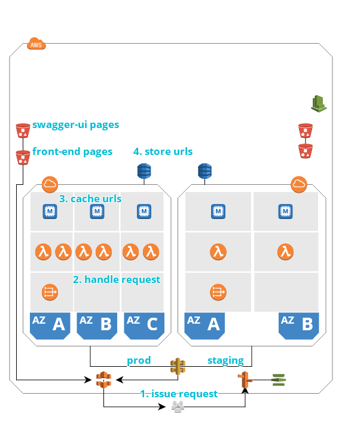

# Craft a shorten URL service base on AWS in 1 day

With Cloud Computing becoming popular, uniform and standard software development methodologies are arising, meaning that companies can leverage out-of-the-box infrastructures provided by Cloud providers, such as AWS, to craft complex yet competitive software product in order to domain markets in a short time, sometime, even in a day. Here, I will show you how to combine some sort of services provided by AWS, to build a production-grade shorten URL service with high availability, resiliency and maintainability in just one day!

This guide will walk you through the process of crafting a production-grade shorten URL service, including the service itself and its function, the architecture design for the service, the corresponding CI/CD workflow for developing the service, the business outcome, and the prerequisites for the service to go online. Hence, it will consists of the following sections:

1. Introduction
2. Service design
3. Approach
4. Business Outcome
5. Go Live

Feel free to read the guide from start to finish or skip around to whatever part interests you.

## Introduction

[digolds.top](https://digolds.top) is a url-shorten service with a feature of generating shorter urls and redirecting them to original urls whenever there has internet access. Digital marketers who make use of this service can create tens of thousands of shorter urls with each spread across global and insert them into digital contents without losing the readability. Lower latency and shorter urls can help readers access the original contents with effortlessness. As a consequence, more traffics will flow to the orginal ones and more customer conversions will take place. 

a shorter url can be shared in any kind of digital contents, such as Posts on SNS, newspaper etc. Anyone who has internet access, can visit the shorter url without limits, so the traffics [digolds.top](https://digolds.top) serve are public to the world.

You may urge to know how [digolds.top](https://digolds.top) stores these shorter urls and makes them easy to access, how to make it serve hundreds of thousands of end users on internet, and how to build up a foundation for better development of shipping new features to [digolds.top](https://digolds.top). Well, with all these questions in mind, Let's dive into the following part.

## Service design

Here is a bird's-eye view for the url shorten service, which can be futher broken into the following 2 parts.

* **CI/CD**: the upside part with `red` lines connecting, which is mainly used for developing the service
* **Service**: the bottom part with `black` lines connecting, which is the url shorten service itself

Let me walk you through each part and explain the idea behind it.

1. CI/CD

The **CI/CD** part is based on `trunk-based` development, so there are 3 auto-build workflows need to be set up. one for `master` branch, to which each commit will trigger a build to run unit tests, do vulnerability detect etc., in order to get feedback for the modification as quickly as possible. The other workflow is for the `release` branch, to which each commit will trigger a build to run unit tests, do vulnerability detect, deploy the update to stage environment for testing. The last workflow is used for releasing features or patches to the production environment with the help of `git tag`. The status results of all these workflows will automatically spread out by email to each engineers, including developers, testers, devops engineers etc. When the release workflows pass, there are many acvities should be done on top of each environment (staging and prod), such as update the Python code to lambda, swagger api and front end pages to S3 etc. Let's zoom in to find out more details about the choosen AWS services that compose of the **CI/CD** part and its workflow.

* 1 step: Engineers commit code to github
* 2 step: AWS CodeBuild will be triggered by each commit on each branch or tags. Each CodeBuild is paired with a workflow and there are 3 workflows each with a specific scenarios, namely master, stage, release workflow. The execute order for the workflows is master->stage->release
* 3 step: After stage workflow pass, there are some activitis need to be executed in stage environment, such as deploy front end pages and swagger ui pages to AWS S3 service.
* 4 step: Instead deploying front end related objects to S3, there should have one more step to update lambda functions in other VPC
* 5 step: When stage environment is ready and tested by quality engineers, there should have an mechanism that automatically duplicate stage environment to prod environment, this is where release workflow come to play. it retrieves package from S3 and deploy the front end assets to S3 in prod environment
* 6 step: Update the lambda functions in prod environment
* x step: Each workflow is configured with CloudWatch Event, SNS, SNS Topic, when engineers commit to github, any changes in these commits will notify all engineers by email

2. Service

The **Service** is compose of VPC, NAT, ElasticCache, Lambda, DynamoDB, API Gateway. DynamoDB acts as storage in which url resources are resided, meanwhile, ElasticCache stands between Lambda and DynamoDB in order to cache the url resources for lower latency. The application run statelessly in Lambda Function, where generating shorter url and redirecting original url handlers happens. Lambda Function need Internet access, so NAT and IGW should be attached to VPC where lambda functions exist. All the requests are issued by end users, and pass through API Gateway to the corresponding lambda function. The service is designed with high availability, so service instances, such as ElasticCache, Lambda Function, are spread across different Available Zones. There are 2 copies of the service in prod and staging environments with a difference that fewer resources are allocated to staging environment. This is a outline for back end system, let's take our focus to the front end pages.

All static pages, including url shorten service pages, swagger ui pages etc., are hosted on S3 service with a front door of CloudFront to accelerate visiting speed. [digolds.top](https://digolds.top) is the domain point to the service, Route53 resolve it to the corresponding CloudFront address, and secure it with AWS ACM service.

With the front end and back end systems building on top of high available and stable AWS service, the url shorten service can serve hundreds of thousands of traffics with ease. Let's review following workflow to decipher how components act to each other.

* 1 step: End users visit [digolds.top](https://digolds.top) in browser. Route 53 resolve the domain name to IP address that points to CloudFront, where url shorten service pages are cached. Then, users may submit an operation to geneate a shorter url in browser, the request will pass to API Gateway
* 2 step: API Gateway will transform the request to lambda function evenly across Available Zones, where each lambda function instance will first get url resources from EleasticCache
* 3 step: ElasticCache will cache part of url resources and provide in-memory access to the resources
* 4 step: if requesting url resource is not exist in ElasticCache, then lambda function will get access to DynamoDB through NAT and IGW

## Approach
The approach you took, the service you compared and why choose these services by the end.
What’s the advantages compared one or the other. What’s the limitation for this service?
What’s the trade off and why made such decision?

## Business Outcome
Potentially the business outcome and usability for this service.

## Go Live
What should be done before your solution go to production? Any additional features or
function that could bring a better user experience in your mind?

## Source Code
Attach the source code at the end.
Attach the IAM read access credential at the end.
